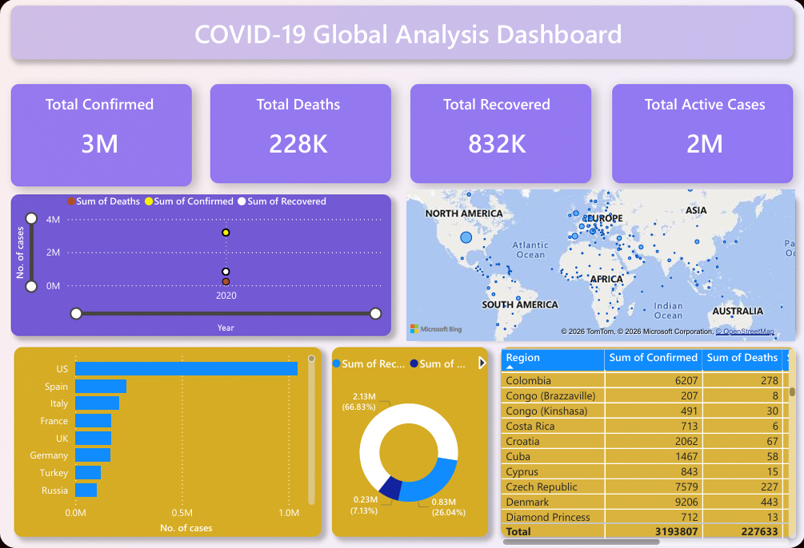

# 🦠 COVID-19 Data Analysis & Visualization

## 📌 Project Overview

This project performs end-to-end data analysis on COVID-19 data using Python and builds an interactive dashboard using Power BI.

---

## 📸 Dashboard Preview



---

## ⚙️ Tech Stack

* Python (Pandas, NumPy, Matplotlib, Seaborn)
* Power BI
* Google Colab

---

## 🔍 Key Features

* Data Cleaning & Preprocessing
* Exploratory Data Analysis (EDA)
* Feature Engineering (Active Cases, Mortality Rate, Recovery Ratio)
* Time Series Analysis
* Interactive Power BI Dashboard

---

## 📊 Dashboard Highlights

* Global COVID trends over time
* Top 10 affected countries
* Case distribution (Active, Recovered, Deaths)
* Country-wise comparison
* Interactive filters (Date, Country)

---

## 📁 Project Structure

* `data/` → Dataset
* `notebook/` → Python analysis
* `dashboard/` → Power BI file & image

---


## 🚀 How to Run

1. Open notebook in Google Colab or Jupyter
2. Install dependencies:

   ```
   pip install -r requirements.txt
   ```
3. Run all cells

---

## 📌 Outcome

This project demonstrates practical skills in:

* Data Analysis
* Visualization
* Business Intelligence

---

## 👤 Author

Vishnu Mavilla
